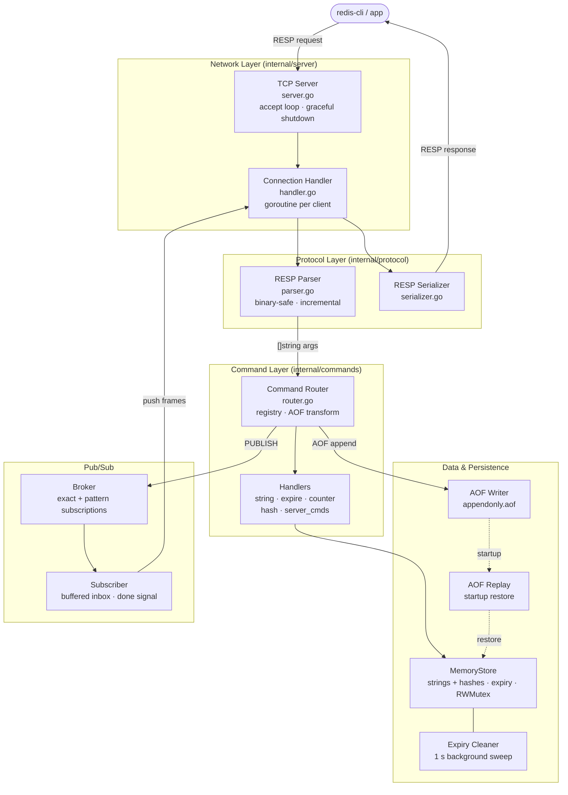

# go-redis

A Redis-compatible server written in Go.

This project was built as a learning project to better understand the
internal architecture of Redis and in-memory data stores. It implements a
subset of Redis features including the RESP v2 protocol, basic data types,
key expiration, Pub/Sub messaging, and AOF persistence.

---

## Key Features

- **RESP v2** — binary-safe incremental parser and serializer
- **Two data types** — strings and hashes, sharing a single key namespace
- **Key expiration** — lazy deletion on reads + 1-second background sweep; TTLs survive restarts via absolute `PEXPIREAT` timestamps in the AOF
- **Pub/Sub** — exact-channel (`SUBSCRIBE`) and glob-pattern (`PSUBSCRIBE`) subscriptions; non-blocking fan-out with slow-consumer protection
- **AOF persistence** — three fsync policies (`always`, `everysec`, `no`); startup replay reconstructs in-memory state
- **Graceful shutdown** — SIGTERM/SIGINT drains connections before exit
- **Race-safe** — `sync.RWMutex` throughout; 175 tests pass with `-race`

---

## Supported Commands

| Category | Commands |
|----------|----------|
| Connection | `PING`, `SELECT` |
| Strings | `SET`, `GET`, `DEL`, `EXISTS`, `KEYS`, `MSET`, `MGET`, `SETNX`, `SETEX`, `PSETEX`, `GETSET`, `GETDEL`, `APPEND`, `STRLEN` |
| Counters | `INCR`, `INCRBY`, `DECR`, `DECRBY` |
| Expiry | `EXPIRE`, `PEXPIRE`, `TTL`, `PTTL`, `PERSIST` |
| Hashes | `HSET`, `HMSET`, `HGET`, `HDEL`, `HGETALL`, `HMGET`, `HLEN`, `HEXISTS`, `HKEYS`, `HVALS`, `HINCRBY` |
| Pub/Sub | `PUBLISH`, `SUBSCRIBE`, `UNSUBSCRIBE`, `PSUBSCRIBE`, `PUNSUBSCRIBE` |
| Admin | `INFO`, `DBSIZE`, `TYPE`, `RENAME`, `FLUSHDB`, `FLUSHALL`, `COMMAND` |

---

## Quick Start

**Requirements:** Go 1.24+ or Docker

```bash
# Run locally
make run

# Run with Docker (development — live source mount)
make docker-dev

# Run with Docker (production — scratch image)
make docker-prod
```

The server listens on `0.0.0.0:6379` by default. Configuration is via flags:

```bash
./go-redis -port 6380 -aof-sync everysec -log-level debug
```

---

## Example Usage

```bash
# Strings and counters
redis-cli SET user:42:name "Alice"
redis-cli INCR user:42:logins          # (integer) 1
redis-cli MSET a 1 b 2 c 3
redis-cli MGET a b c                   # 1, 2, 3

# Key expiration
redis-cli SETEX session:token 300 "user:42"
redis-cli TTL session:token            # (integer) 300
redis-cli PERSIST session:token        # removes TTL

# Hashes
redis-cli HSET habit:1 name "Exercise" goal 30 streak 0
redis-cli HINCRBY habit:1 streak 1     # (integer) 1
redis-cli HGETALL habit:1

# Pub/Sub — exact channel (terminal 1)
redis-cli SUBSCRIBE habits:updates

# Pub/Sub — publish (terminal 2)
redis-cli PUBLISH habits:updates "new-habit-added"   # (integer) 1

# Pattern subscription
redis-cli PSUBSCRIBE "habits:*"        # receives all habits:* channels
```

---

## Architecture



Each client connection runs in its own goroutine. The handler intercepts
`SUBSCRIBE` and `PSUBSCRIBE` before the router so it can manage
per-connection subscription state and a dedicated write-loop goroutine.

---

## Habit-Buddy Use Cases

| Use case | Commands |
|----------|----------|
| Store habit metadata | `HSET habit:<id> name <n> goal <g> streak 0` |
| Increment daily streak | `HINCRBY habit:<id> streak 1` |
| Session tokens with TTL | `SETEX session:<token> 3600 <user_id>` |
| Rate limiting | `INCR ratelimit:<ip>` + `EXPIRE ratelimit:<ip> 60` |
| Realtime notifications | `PUBLISH habits:updates <payload>` |
| Listen to all habit events | `PSUBSCRIBE "habits:*"` |
| Daily completion counters | `INCR daily:completions:<date>` |

---

## Development

```bash
make build          # compile binary to ./go-redis
make run            # run with go run
make test           # run all tests
make test-race      # run tests with race detector (recommended)
make test-cover     # generate HTML coverage report
make fmt            # gofmt all source files
make vet            # run go vet
make lint           # run golangci-lint (must be installed)
make tidy           # go mod tidy
make docker-dev     # start development container
make docker-prod    # build and run production image
make docker-down    # stop containers
make clean          # remove build artifacts
```

---

## Documentation

Step-by-step design notes covering each subsystem:

| # | File | Topic |
|---|------|-------|
| 01 | [01-project-scope.md](docs/01-project-scope.md) | Scope and learning objectives |
| 02 | [02-architecture.md](docs/02-architecture.md) | System architecture and data flow |
| 03 | [03-project-structure.md](docs/03-project-structure.md) | Repository layout |
| 04 | [04-dev-environment.md](docs/04-dev-environment.md) | Docker, Makefile, local setup |
| 05 | [05-resp-protocol.md](docs/05-resp-protocol.md) | RESP v2 wire format |
| 06 | [06-tcp-server.md](docs/06-tcp-server.md) | TCP listener and goroutine model |
| 07 | [07-command-handler.md](docs/07-command-handler.md) | Command router and AOF transforms |
| 08 | [08-storage.md](docs/08-storage.md) | In-memory store, expiry, hash type |
| 09 | [09-persistence-aof.md](docs/09-persistence-aof.md) | AOF write path and replay |
| 10 | [10-request-flow.md](docs/10-request-flow.md) | End-to-end request walkthrough |
| 11 | [11-testing.md](docs/11-testing.md) | Testing strategy |
| — | [pubsub.md](docs/pubsub.md) | Pub/Sub design (SUBSCRIBE + PSUBSCRIBE) |

---

## Limitations

This project implements a Redis-compatible subset, not a full Redis replacement.

| Feature | Status |
|--------|--------|
| List, Set, Sorted Set types | Not implemented |
| Transactions (`MULTI` / `EXEC` / `WATCH`) | Not implemented |
| RDB snapshot persistence | Not implemented |
| AOF rewrite / compaction | Not implemented |
| Replication and clustering | Single-node only |
| AUTH / ACL | Not implemented |
| Lua scripting | Not implemented |
| Memory eviction policies | Not implemented (`maxmemory`, LRU, LFU) |
| Pub/Sub delivery | Best-effort only; messages dropped when subscriber inbox (256) is full |
| Expiration accuracy | Background sweep runs every 1 second |
| KEYS command | Full keyspace scan (O(N)) |
| Multiple databases (`SELECT n`) | `SELECT 0` only |
| Durability guarantees | Depends on AOF fsync policy (`everysec` may lose up to ~1s of data) |
