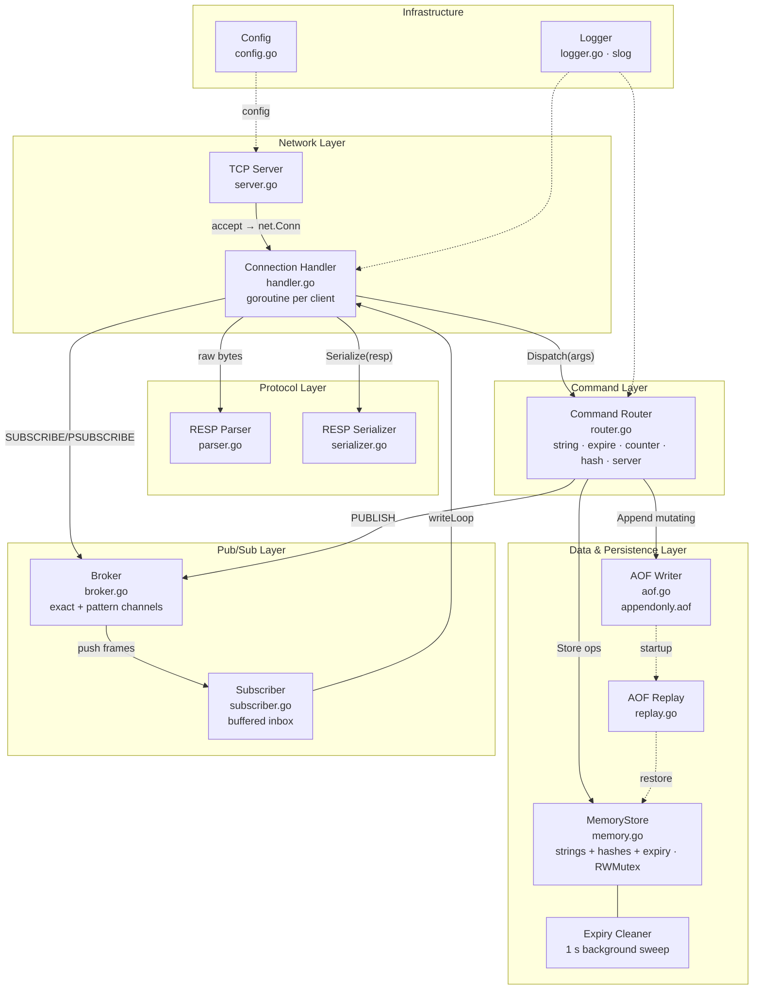
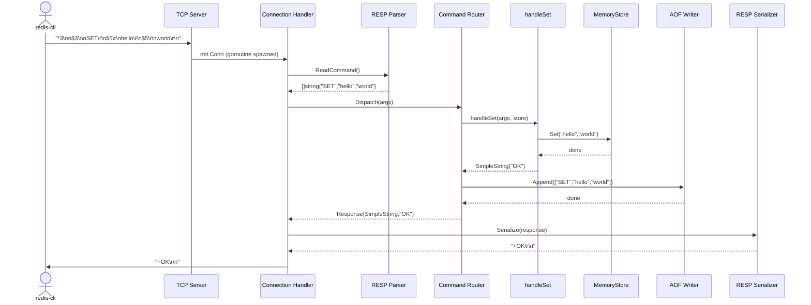
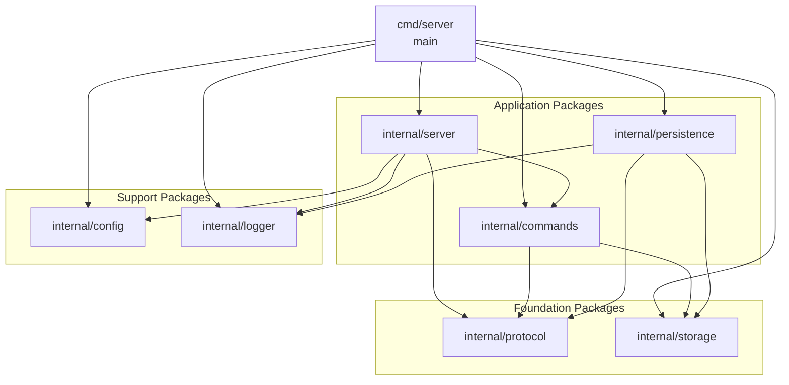

# Step 2 — System Architecture

---

## High-Level Architecture

> PlantUML source: [`docs/diagrams/high-level-architecture.puml`](diagrams/high-level-architecture.puml)



---

## Component Responsibilities

### 1. TCP Server (`internal/server`)

**What it does**: Owns the `net.Listener`. Calls `Accept()` in a loop. For each accepted
connection, spawns a goroutine running the Connection Handler.

**Responsibilities**:
- Bind and listen on the configured address/port
- Accept new TCP connections
- Spawn one goroutine per connection
- Manage graceful shutdown (signal handling, draining connections)

**Does NOT**:
- Parse any bytes — that is the parser's job
- Know about commands or storage

---

### 2. Connection Handler (`internal/server`)

**What it does**: Lives inside the per-connection goroutine. Owns the read/write loop
for a single client.

**Responsibilities**:
- Read raw bytes from the TCP socket
- Feed bytes to the RESP parser
- Pass parsed command arrays to the Command Router
- Write the response back to the socket
- Handle client disconnection (EOF) and protocol errors

**Lifecycle**:
```
accept → spawn goroutine → read loop → parse → dispatch → write → loop
                                                                      ↓
                                                                  client disconnects
                                                                  goroutine exits
```

---

### 3. RESP Parser / Serializer (`internal/protocol`)

**What it does**: Converts raw bytes ↔ Go types according to the RESP v2 specification.

**Responsibilities**:
- Parse incoming RESP messages into `[]string` (command + arguments)
- Serialize Go values back into RESP wire format for responses
- Handle all 5 RESP data types: Simple String, Error, Integer, Bulk String, Array

**Key design point**: The parser wraps a `bufio.Reader` so it handles partial TCP reads
transparently. The parser never blocks on incomplete data — it reads until CRLF
boundaries.

---

### 4. Command Router (`internal/commands`)

**What it does**: Receives a `[]string` from the parser and dispatches to the correct
handler function. After execution, it writes the appropriate AOF record.

**Responsibilities**:
- Maintain a `map[string]HandlerFunc` registry (50+ commands)
- Normalize command names to uppercase
- Call the handler and collect the response
- Translate time-relative commands to absolute timestamps for AOF correctness:
  - `EXPIRE key N` → logs `PEXPIREAT key <abs_ms>`
  - `SETEX key N value` → logs `SET key value` + `PEXPIREAT key <abs_ms>`
  - `INCR/DECR key` → logs `SET key <final_value>` (idempotent replay)

**Command files**:
| File | Commands |
|------|----------|
| `string.go` | SET, GET, DEL, EXISTS, KEYS, MSET, MGET, SETNX, SETEX, PSETEX, GETSET, GETDEL, APPEND, STRLEN |
| `expire.go` | EXPIRE, PEXPIRE, TTL, PTTL, PERSIST |
| `counter.go` | INCR, INCRBY, DECR, DECRBY |
| `hash.go` | HSET, HMSET, HGET, HDEL, HGETALL, HMGET, HLEN, HEXISTS, HKEYS, HVALS, HINCRBY |
| `server_cmds.go` | INFO, DBSIZE, TYPE, RENAME, FLUSHDB, FLUSHALL, SELECT |
| `pubsub.go` | PUBLISH |
| `ping.go` | PING |
| `meta.go` | COMMAND |

---

### 5. In-Memory Database (`internal/storage`)

**What it does**: Thread-safe store for both string and hash data types, with per-key
TTL expiration.

**Responsibilities**:
- Store strings and hashes under the same namespace (key names are unique across types)
- Enforce expiry: lazy deletion on every read + active sweep every second
- Protect concurrent access with `sync.RWMutex`
- Provide a clean `Store` interface for testability

**Key design choices**:

| Choice | Rationale |
|--------|-----------|
| Separate `strings` and `hashes` maps | Avoids `interface{}` boxing; type-safe access |
| `expiresAt time.Time` (zero = no expiry) | Simple; avoids a separate TTL map for strings |
| Lazy expiry on reads | Expired keys are invisible immediately without needing the background sweep |
| Background sweep (1 s) | Reclaims memory for expired keys that are never read again |
| `StartCleanup(ctx)` for the sweep goroutine | Tied to the server context; exits cleanly on shutdown |

**Store interface (condensed)**:
```go
type Store interface {
    // Strings
    Set(key, value string)
    SetWithTTL(key, value string, ttl time.Duration)
    Get(key string) (string, bool)
    Del(keys ...string) int
    // Expiry
    Expire(key string, ttl time.Duration) bool
    TTL(key string) time.Duration   // -1 = no TTL, -2 = not found
    Persist(key string) bool
    // Hashes
    HSet(key string, fields map[string]string) int
    HGet(key, field string) (string, bool)
    HGetAll(key string) map[string]string
    // ...
    Type(key string) string   // "string" | "hash" | "none"
    Rename(src, dst string) bool
}
```

---

### 6. Pub/Sub Layer (`internal/pubsub`)

**What it does**: Decoupled message broker supporting both exact-channel and glob-pattern
subscriptions.

**Components**:
- **Broker** (`broker.go`): maintains two registries:
  - `channels map[string]map[*Subscriber]struct{}` — for SUBSCRIBE
  - `patterns map[string]map[*Subscriber]struct{}` — for PSUBSCRIBE
- **Subscriber** (`subscriber.go`): per-connection mailbox with a 256-entry buffered
  inbox channel and a `done` channel for shutdown signalling.
- **Message encoders** (`message.go`): RESP frames for `message`, `pmessage`,
  `subscribe`/`unsubscribe`, `psubscribe`/`punsubscribe` ACKs.

**Non-blocking publish**: the broker snapshots the subscriber set under a read lock,
then sends to each subscriber's inbox after releasing the lock. A full inbox causes
the message to be silently dropped (slow consumer protection).

**Pattern matching**: uses `filepath.Match` (same as KEYS), supporting `*`, `?`, and
character ranges.

---

### 9. Persistence Layer — AOF (`internal/persistence`)

**What it does**: Writes every mutating command to an append-only file on disk.
On startup, replays the file to reconstruct in-memory state.

**Responsibilities**:
- Receive transformed AOF records from the Command Router
- Serialize them in RESP format and append to the file
- On startup: open the AOF file, re-execute every command against the store
- Manage fsync policy (`always` / `everysec` / `no`)

**TTL correctness across restarts**:
Commands with relative TTLs are converted to `PEXPIREAT key <unix_ms>` before
being written to the AOF. During replay, `PEXPIREAT` computes the remaining
duration and calls `store.Expire(key, remaining)`. If the timestamp is already
in the past the key is deleted instead of restored.

```
Write path:  EXPIRE foo 10  →  PEXPIREAT foo 1700000000000
Replay path: PEXPIREAT foo 1700000000000
               remaining = now - 1700000000000
               if remaining > 0: store.Expire("foo", remaining)
               else: store.Del("foo")
```

---

### 10. Config Module (`internal/config`)

**What it does**: Loads and exposes server configuration from flags and/or a config file.

**Key fields**:
```go
type Config struct {
    Host       string
    Port       int
    AOFEnabled bool
    AOFPath    string
    AOFSync    string // "always" | "everysec" | "no"
    LogLevel   string
    MaxClients int
}
```

---

### 11. Logger (`internal/logger`)

**What it does**: Provides structured, leveled logging used by all components.

**Responsibilities**:
- Wrap Go's `log/slog` (available since Go 1.21)
- Support levels: DEBUG, INFO, WARN, ERROR
- Include component context in log lines

---

## Data Flow: Full Request Path

Here is the exact path a `SET hello world` command travels through the system.

> Full sequence detail: [`docs/diagrams/request-flow.puml`](diagrams/request-flow.puml)



---

## Component Dependency Graph

> PlantUML source: [`docs/diagrams/dependency-graph.puml`](diagrams/dependency-graph.puml)



Dependencies only flow **downward**. No component imports the layer above it.
This is the key architectural rule that keeps the system testable and maintainable.

---

## Key Architectural Decisions

| Decision | Choice | Rationale |
|----------|--------|-----------|
| Concurrency model | Goroutine per connection | Simple, idiomatic Go; scales to thousands of clients |
| Storage sync | `sync.RWMutex` | Multiple readers in parallel; writes are exclusive |
| Parser I/O | `bufio.Reader` | Handles partial TCP reads; efficient buffering |
| Persistence format | RESP in AOF | Reuses the protocol layer; human-readable; easy to replay |
| `Store` interface | Yes | Allows mock storage in tests; decouples commands from concrete type |
| Expiry storage | `expiresAt time.Time` on `strEntry` | Zero value = no expiry; avoids separate TTL map for strings |
| Hash storage | Separate `hashes map[string]map[string]string` | Type-safe; no `interface{}` boxing overhead |
| AOF expiry records | `PEXPIREAT key <abs_ms>` | Absolute timestamps survive restarts with correct remaining TTL |
| Pub/Sub inbox | Buffered chan, never closed | Prevents send-on-closed-channel panic; `done` channel signals shutdown |
| PSUBSCRIBE matching | `filepath.Match` | Same glob semantics as KEYS; no extra dependency |
