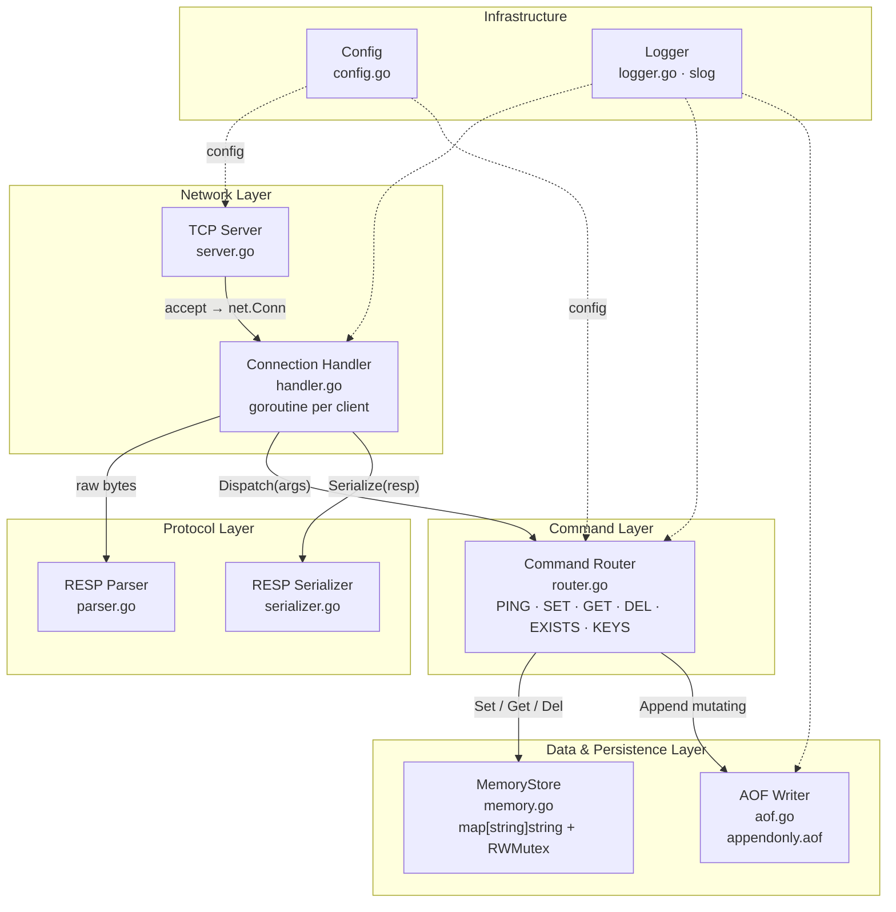
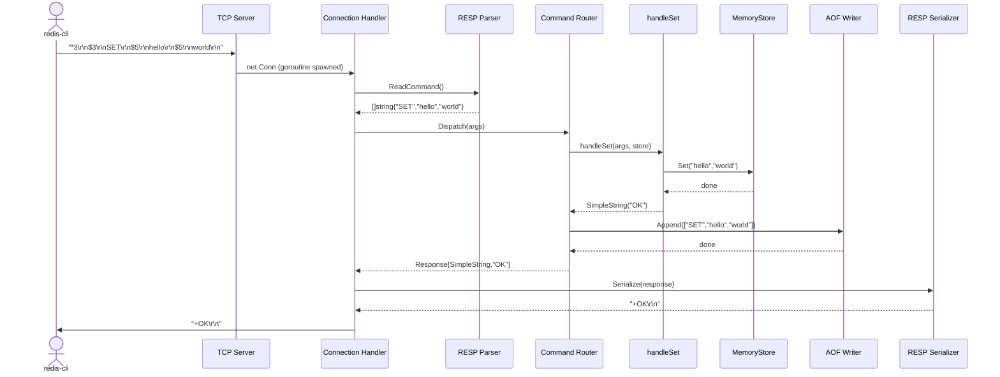
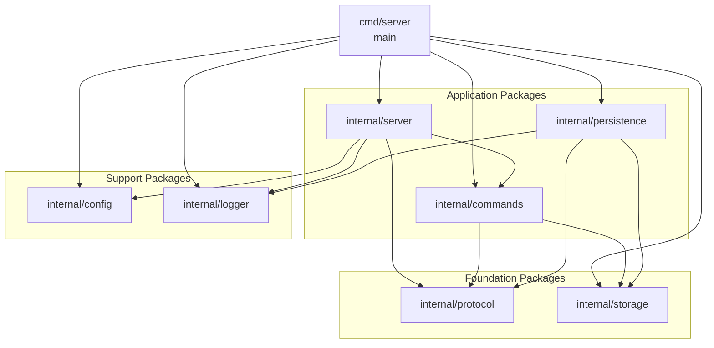

# Step 2 — System Architecture

---

## High-Level Architecture

> PlantUML source: [`docs/diagrams/high-level-architecture.puml`](diagrams/high-level-architecture.puml)



---

## Component Responsibilities

### 1. TCP Server (`internal/server`)

**What it does**: Owns the `net.Listener`. Calls `Accept()` in a loop. For each accepted
connection, spawns a goroutine running the Connection Handler.

**Responsibilities**:
- Bind and listen on the configured address/port
- Accept new TCP connections
- Spawn one goroutine per connection
- Manage graceful shutdown (signal handling, draining connections)

**Does NOT**:
- Parse any bytes — that is the parser's job
- Know about commands or storage

---

### 2. Connection Handler (`internal/server`)

**What it does**: Lives inside the per-connection goroutine. Owns the read/write loop
for a single client.

**Responsibilities**:
- Read raw bytes from the TCP socket
- Feed bytes to the RESP parser
- Pass parsed command arrays to the Command Router
- Write the response back to the socket
- Handle client disconnection (EOF) and protocol errors

**Lifecycle**:
```
accept → spawn goroutine → read loop → parse → dispatch → write → loop
                                                                      ↓
                                                                  client disconnects
                                                                  goroutine exits
```

---

### 3. RESP Parser / Serializer (`internal/protocol`)

**What it does**: Converts raw bytes ↔ Go types according to the RESP v2 specification.

**Responsibilities**:
- Parse incoming RESP messages into `[]string` (command + arguments)
- Serialize Go values back into RESP wire format for responses
- Handle all 5 RESP data types: Simple String, Error, Integer, Bulk String, Array

**Key design point**: The parser wraps a `bufio.Reader` so it handles partial TCP reads
transparently. The parser never blocks on incomplete data — it reads until CRLF
boundaries.

---

### 4. Command Router (`internal/commands`)

**What it does**: Receives a `[]string` from the parser and dispatches to the correct
handler function.

**Responsibilities**:
- Maintain a `map[string]CommandHandlerFunc` registry
- Normalize command names (uppercase)
- Validate argument counts before dispatch
- Return a typed `Response` that the connection handler serializes

**Design**:
```go
type CommandHandlerFunc func(args []string, store storage.Store) Response

var registry = map[string]CommandHandlerFunc{
    "PING": handlePing,
    "SET":  handleSet,
    "GET":  handleGet,
    "DEL":  handleDel,
}
```

---

### 5. In-Memory Database (`internal/storage`)

**What it does**: Thread-safe key-value map. The single source of truth for all data.

**Responsibilities**:
- Store and retrieve string key-value pairs
- Protect concurrent access with `sync.RWMutex`
- Provide a clean interface (`Store`) so the implementation can be swapped

**Interface**:
```go
type Store interface {
    Set(key, value string)
    Get(key string) (string, bool)
    Del(keys ...string) int
    Exists(keys ...string) int
    Keys(pattern string) []string
}
```

---

### 6. Persistence Layer — AOF (`internal/persistence`)

**What it does**: Writes every mutating command to an append-only file on disk.
On startup, replays the file to reconstruct in-memory state.

**Responsibilities**:
- Receive commands from the Command Router after successful execution
- Serialize them in RESP format and append to the AOF file
- On startup: open the AOF file, re-execute every command against the store
- Manage fsync policy (always / every second / never)

---

### 7. Config Module (`internal/config`)

**What it does**: Loads and exposes server configuration from flags and/or a config file.

**Key fields**:
```go
type Config struct {
    Host       string
    Port       int
    AOFEnabled bool
    AOFPath    string
    AOFSync    string // "always" | "everysec" | "no"
    LogLevel   string
    MaxClients int
}
```

---

### 8. Logger (`internal/logger`)

**What it does**: Provides structured, leveled logging used by all components.

**Responsibilities**:
- Wrap Go's `log/slog` (available since Go 1.21)
- Support levels: DEBUG, INFO, WARN, ERROR
- Include component context in log lines

---

## Data Flow: Full Request Path

Here is the exact path a `SET hello world` command travels through the system.

> Full sequence detail: [`docs/diagrams/request-flow.puml`](diagrams/request-flow.puml)



---

## Component Dependency Graph

> PlantUML source: [`docs/diagrams/dependency-graph.puml`](diagrams/dependency-graph.puml)



Dependencies only flow **downward**. No component imports the layer above it.
This is the key architectural rule that keeps the system testable and maintainable.

---

## Key Architectural Decisions

| Decision           | Choice                    | Rationale                                                           |
|--------------------|---------------------------|---------------------------------------------------------------------|
| Concurrency model  | Goroutine per connection   | Simple, idiomatic Go; scales to thousands of concurrent clients     |
| Storage sync       | `sync.RWMutex`            | Multiple readers proceed in parallel; writes are exclusive          |
| Parser I/O         | `bufio.Reader`            | Handles partial TCP reads; efficient buffering                      |
| Persistence format | RESP in AOF               | Reuses the protocol layer; human-readable; easy to replay           |
| Interfaces         | `Store` interface         | Allows mock storage in tests; enables future sharded implementation |
