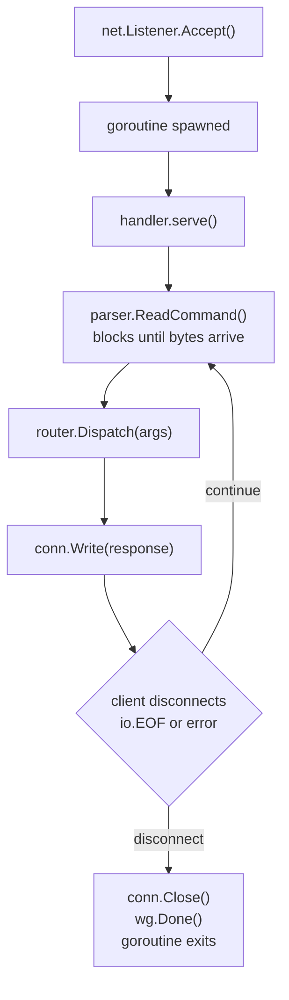

# Step 6 — TCP Server

---

## Design Decisions

### Goroutine-per-connection model

Go's runtime multiplexes goroutines onto OS threads using an M:N scheduler.
Each goroutine starts with a ~8KB stack that grows dynamically.

- 10,000 concurrent clients ≈ 10,000 goroutines ≈ ~80 MB of stack — entirely viable
- Each goroutine blocks on `conn.Read()` — the scheduler parks it and runs another
  goroutine on the same OS thread
- No `epoll`/`select` event loop needed — Go's scheduler is the event loop

### Graceful shutdown

When the server receives `SIGINT` or `SIGTERM`:
1. `context.Context` is cancelled (via `signal.NotifyContext`)
2. A goroutine watching `ctx.Done()` closes the listener
3. `ln.Accept()` unblocks and returns `net.ErrClosed`
4. The accept loop exits
5. `srv.wg.Wait()` blocks until all active handlers finish their current command
6. `Run()` returns — the process exits cleanly

### Separation of concerns

| File | Responsibility |
|---|---|
| `server.go` | Owns `net.Listener`, accept loop, shutdown, connection counting |
| `handler.go` | Owns single-connection read/parse/dispatch/write loop |

Neither file knows about RESP encoding or command semantics.

---

## Files

| File | Purpose |
|---|---|
| `internal/server/server.go` | TCP listener, accept loop, graceful shutdown |
| `internal/server/handler.go` | Per-connection command loop |
| `internal/config/config.go` | Config struct, flag parsing |
| `internal/logger/logger.go` | slog wrapper |
| `internal/storage/store.go` | Store interface |
| `internal/storage/memory.go` | RWMutex-backed in-memory implementation |
| `internal/commands/router.go` | Command registry and dispatch |
| `internal/commands/ping.go` | PING handler |
| `internal/commands/string.go` | SET / GET / DEL / EXISTS / KEYS handlers |
| `cmd/server/main.go` | Wires all components, handles OS signals |

---

## Connection Lifecycle



---

## Smoke Test Results

```bash
redis-cli -p 7379 PING      → PONG
redis-cli -p 7379 SET hello world  → OK
redis-cli -p 7379 GET hello        → "world"
redis-cli -p 7379 EXISTS hello     → (integer) 1
redis-cli -p 7379 DEL hello        → (integer) 1
redis-cli -p 7379 GET hello        → (nil)
redis-cli -p 7379 KEYS "*"         → (empty array)
```
