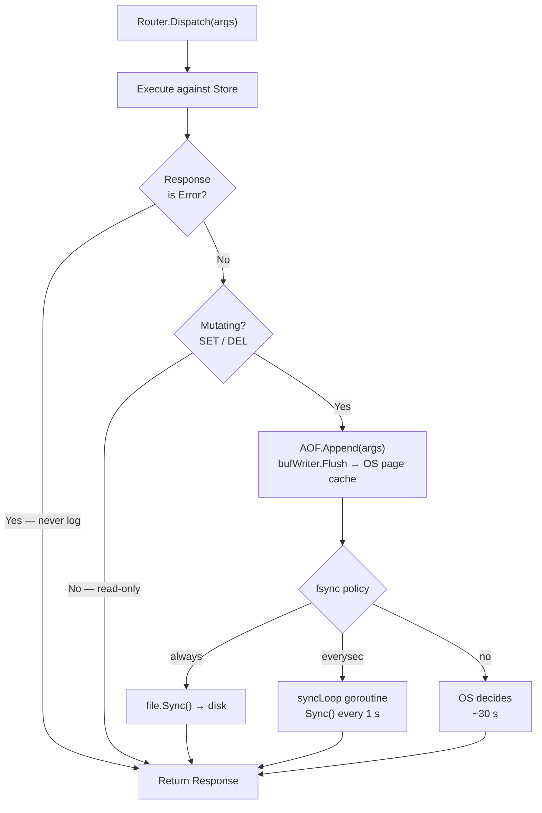
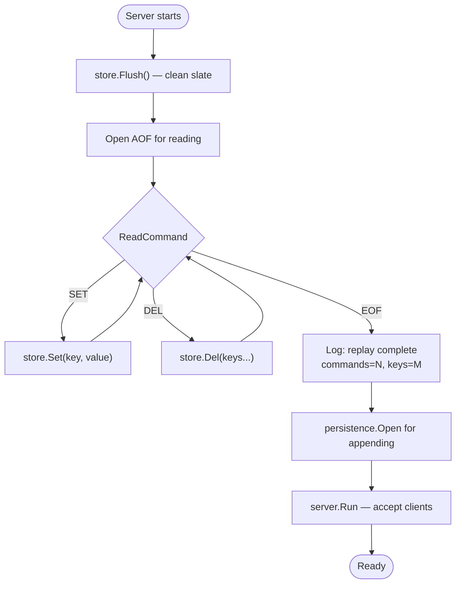

# Step 9 — AOF Persistence

---

## What is an Append-Only File?

AOF is a **write-ahead log** — every mutating command is serialized and appended
to a file on disk *after* it executes successfully in memory. On startup, the server
replays the file from top to bottom to reconstruct the in-memory state.

Same pattern as: PostgreSQL WAL, Kafka log segments, etcd Raft log.

---

## AOF File Format

Commands are stored as back-to-back RESP arrays — the same encoding the client sends.

```
*3\r\n$3\r\nSET\r\n$5\r\nhello\r\n$5\r\nworld\r\n
*2\r\n$3\r\nDEL\r\n$5\r\nhello\r\n
```

Reuses the existing protocol layer. Human-readable. Trivially parseable.

---

## fsync Policy

Writing to a file calls `write(2)` — data enters the OS page cache, not disk.
`fsync(2)` forces the cache to disk.

| Policy | When | Durability | Throughput |
|---|---|---|---|
| `always` | After every command | Max — 0 commands lost | Lowest |
| `everysec` | Background goroutine, 1/sec | Good — ≤1 sec of writes lost | High |
| `no` | Never | Weakest — OS decides (~30s) | Highest |

Default: `everysec` — same as Redis.

---

## Import Cycle Prevention

```
persistence → storage   (replay calls store.Set/Del directly)
persistence → protocol  (replay uses the RESP parser)
commands    → storage
commands    → protocol
```

If `commands → persistence` AND `persistence → commands` → **cycle**.

Solution: `commands` defines a one-method `Appender` interface.
`*persistence.AOF` satisfies it. `main.go` wires them.

```go
// In commands/router.go — no persistence import needed
type Appender interface {
    Append(args []string) error
}
```

---

## What Gets Logged

Only **mutating** commands that **succeed**:

```go
var mutatingCommands = map[string]bool{
    "SET": true,
    "DEL": true,
}

// In Dispatch — after successful execution:
if r.aof != nil && mutatingCommands[name] && resp.Type != protocol.TypeError {
    _ = r.aof.Append(args)
}
```

`GET`, `PING`, `EXISTS`, `KEYS` are never written — they don't change state.
Failed commands (TypeError responses) are never written — they must not be replayed.

---

## Replay Logic

> PlantUML source: [`docs/diagrams/aof-flow.puml`](diagrams/aof-flow.puml)

**Write Path — per command:**



**Startup Replay:**



Replay bypasses the Router — no further AOF writes, no import cycle.

---

## End-to-End Verification

```
Server 1 writes:
  SET name alice   → AOF: *3\r\n$3\r\nSET\r\n$4\r\nname\r\n$5\r\nalice\r\n
  SET city bangkok → AOF: *3\r\n$3\r\nSET\r\n$4\r\ncity\r\n$7\r\nbangkok\r\n
  DEL city         → AOF: *2\r\n$3\r\nDEL\r\n$4\r\ncity\r\n

Server 2 startup log:
  {"msg":"aof replay complete","commands":3,"keys":1}

Server 2 queries:
  GET name → "alice"    ✓
  GET city → (nil)      ✓  (DEL was replayed)
```

---

## Files

| File | Responsibility |
|---|---|
| `internal/persistence/aof.go` | `AOF` writer, `bufio` buffer, fsync policies, `syncLoop` goroutine |
| `internal/persistence/replay.go` | `Replay()` — parse AOF and apply directly to store |
| `internal/persistence/aof_test.go` | 10 tests: write, replay, round-trip, flush-first, sync-always |
| `internal/commands/router.go` | `Appender` interface, `mutatingCommands` set, AOF call in `Dispatch` |
| `cmd/server/main.go` | `setupAOF()` — replay then open; wires into Router |
