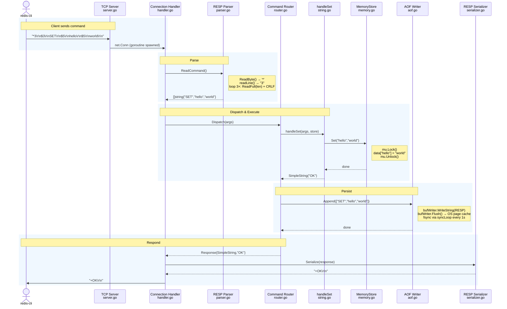
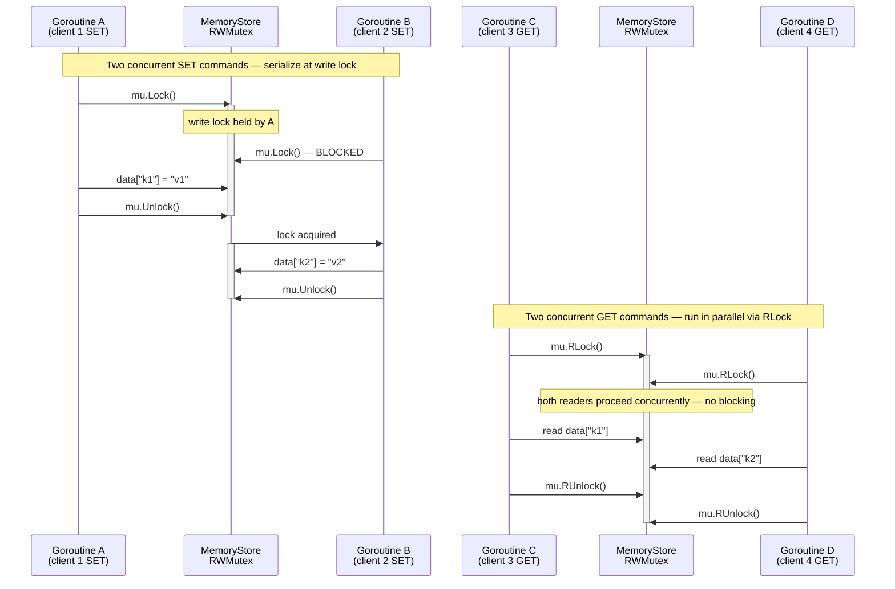
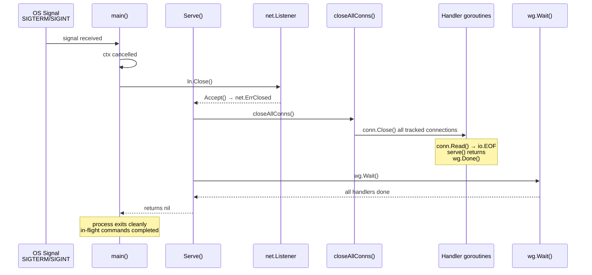
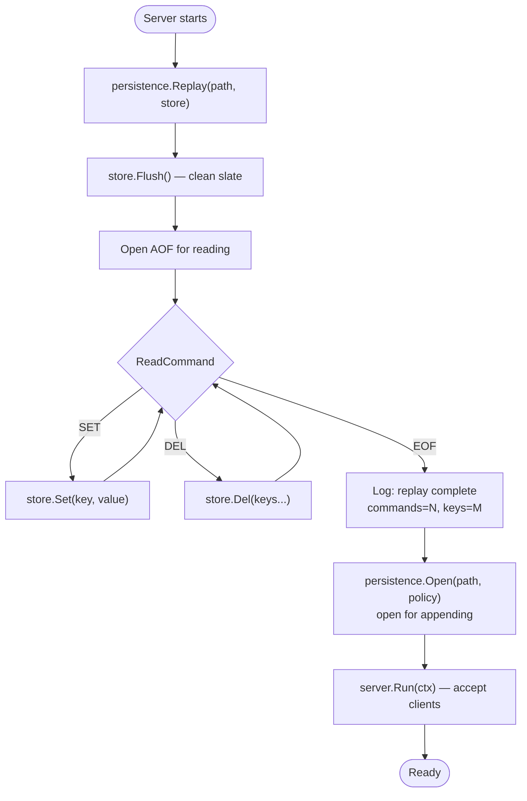

# Step 10 — Request Flow Walkthrough

This step traces a single `SET hello world` command from the moment a TCP packet
arrives to the moment `+OK\r\n` leaves the server.

---

## The Full Path

> PlantUML source: [`docs/diagrams/request-flow.puml`](diagrams/request-flow.puml)



---

## Layer-by-Layer Timing

```
Phase                    Typical cost     Notes
─────────────────────────────────────────────────────────────────────
Network RTT              0.1–50 ms        Depends on client proximity
TCP Accept               ~1 µs            net.Listener.Accept()
Goroutine spawn          ~1 µs            Stack alloc + scheduler
bufio.Reader.Read        ~0 µs            Data already in kernel buffer
RESP parse               ~200 ns          ReadString + Atoi + ReadFull
map lookup (registry)    ~10 ns           Hash + compare
RWMutex.Lock             ~20–100 ns       Uncontended; ~3× under load
map write (store.Set)    ~20–40 ns        Hash + insert; 0 allocs
bufio.WriteString (AOF)  ~30 ns           Writes to userspace buffer
Serialize response       ~50 ns           String concat
conn.Write               ~500 ns          Syscall write() to kernel
─────────────────────────────────────────────────────────────────────
Total (excluding RTT):   ~1–2 µs
```

The network RTT dominates. In-memory operations are nanoseconds.

---

## Concurrent Clients

> PlantUML source: [`docs/diagrams/concurrent-clients.puml`](diagrams/concurrent-clients.puml)



---

## Graceful Shutdown

> PlantUML source: [`docs/diagrams/graceful-shutdown.puml`](diagrams/graceful-shutdown.puml)



---

## AOF Replay on Startup

> PlantUML source: [`docs/diagrams/aof-flow.puml`](diagrams/aof-flow.puml)



No client connection is accepted until replay is complete.
Clients always see a consistent post-replay state.
