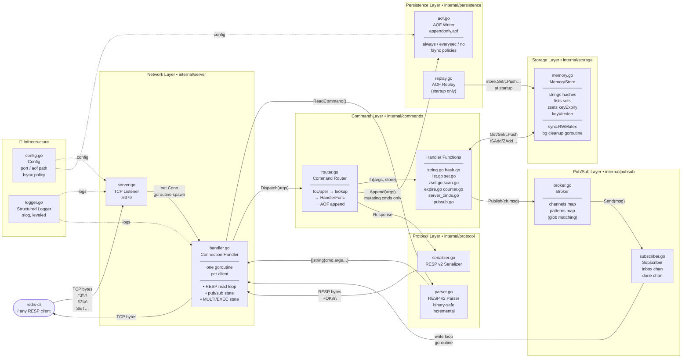

# System Architecture

End-to-end view of every layer in the go-redis server — from the TCP socket that accepts client connections to the disk file that survives restarts.

## Key Design Decisions

| Decision | Rationale |
|----------|-----------|
| Goroutine per connection | Exploits Go's scheduler; simpler than event loop; no shared handler state needed |
| `storage.Store` interface | Allows mock injection in tests; decouples commands from storage implementation |
| Handler intercepts SUBSCRIBE/MULTI | These are connection-state commands — the router only knows stateless pure functions |
| AOF after command succeeds | Guarantees the log only contains operations that actually changed state |
| `commands.Appender` interface | Prevents import cycle: `commands` must not import `persistence` |
