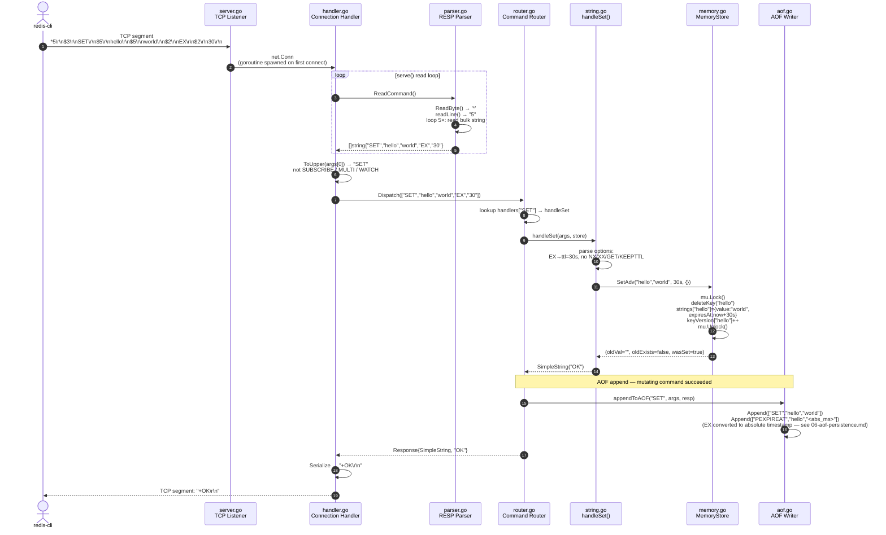
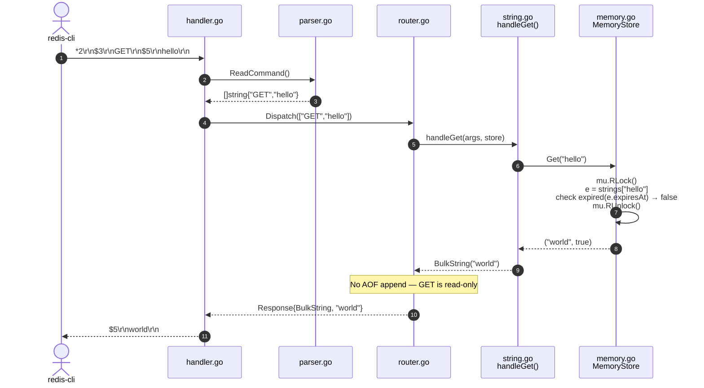
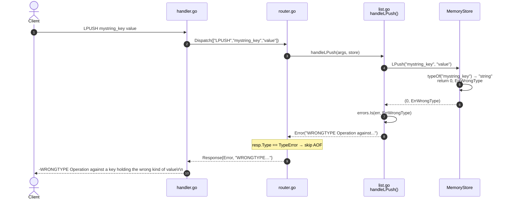

# Request Flow

Two complete request lifecycles: a plain `SET` (read/write path) and a `GET` (read-only path).

## Normal Command: `SET hello world EX 30`

## Read-Only Command: `GET hello`

## Error Path: Wrong Type

