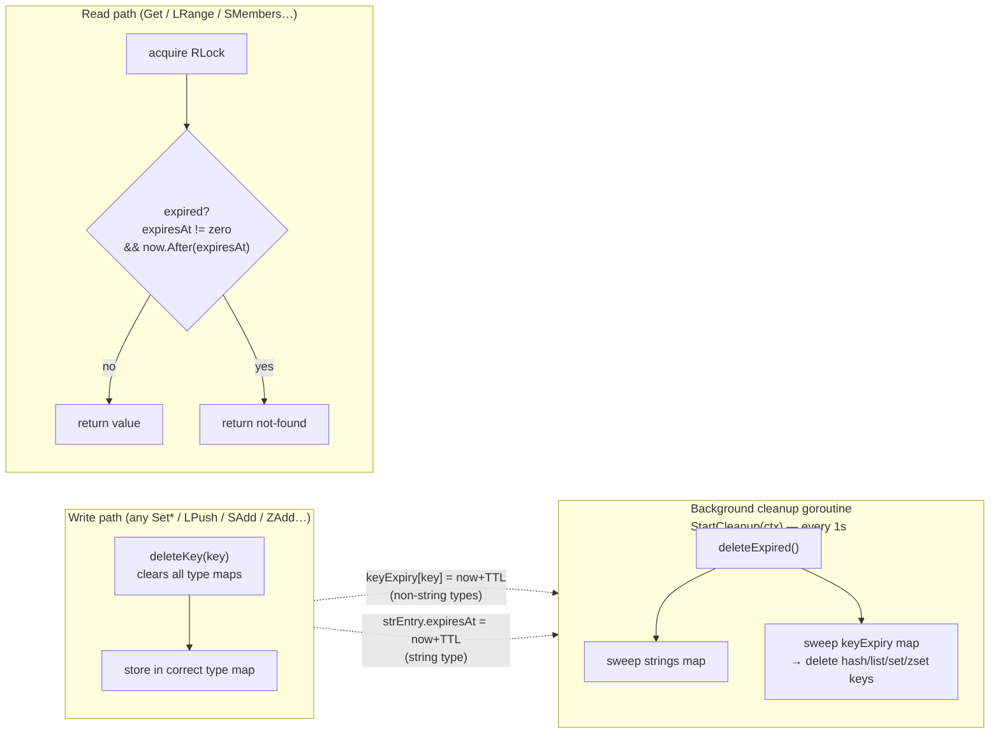
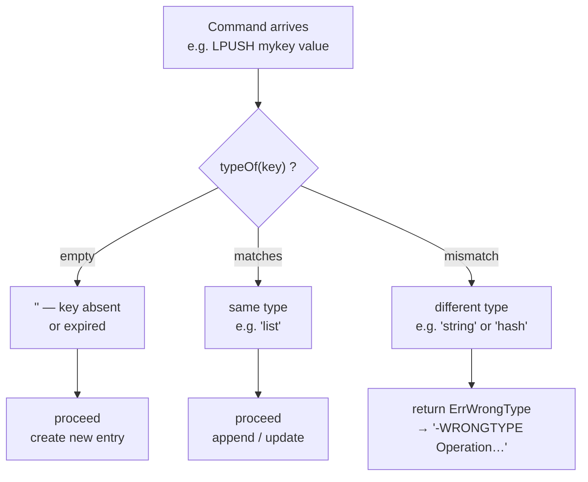
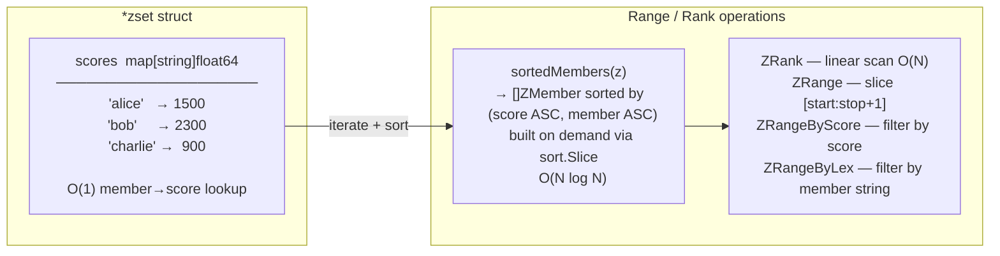
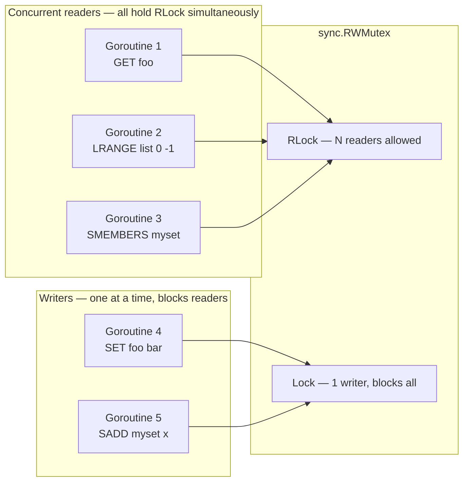

# Storage Data Model

Internal layout of `MemoryStore` — all five data types, the shared expiry map, and the key versioning map used for `WATCH`.

## MemoryStore Struct Layout

```mermaid
flowchart TB
    subgraph MS["MemoryStore  •  memory.go"]
        direction TB

        MU["sync.RWMutex\n─────────────\nProtects all maps below.\nRLock for reads,\nLock for writes."]

        subgraph STRINGS["strings  map[string]strEntry"]
            S1["'name' → {value:'alice', expiresAt:zero}"]
            S2["'counter' → {value:'42', expiresAt:zero}"]
            S3["'session' → {value:'tok123', expiresAt:2026-04-04T13:00}"]
        end

        subgraph HASHES["hashes  map[string]map[string]string"]
            H1["'user:1' → { 'name':'bob', 'age':'30', 'email':'b@x.com' }"]
            H2["'config' → { 'debug':'true', 'port':'6379' }"]
        end

        subgraph LISTS["lists  map[string][]string"]
            L1["'queue' → ['job3','job2','job1']  ← index 0 = head"]
            L2["'log'   → ['entry1','entry2','entry3']"]
        end

        subgraph SETS["sets  map[string]map[string]struct{}"]
            SET1["'tags'   → {'go','redis','nosql'}"]
            SET2["'online' → {'alice','bob'}"]
        end

        subgraph ZSETS["zsets  map[string]*zset"]
            Z1["'leaderboard' → scores:{'alice':1500,'bob':2300,'charlie':900}"]
            Z2["'delays' → scores:{'task1':0.5,'task2':1.2}"]
        end

        subgraph EXPIRY["keyExpiry  map[string]time.Time\n(hash / list / set / zset keys only — strings embed expiry in strEntry)"]
            E1["'user:1'  → 2026-04-04T14:00:00"]
            E2["'queue'   → zero  (no TTL)"]
        end

        subgraph VERSION["keyVersion  map[string]uint64\n(incremented on every write — used by WATCH)"]
            V1["'name'         → 3"]
            V2["'leaderboard'  → 7"]
            V3["'counter'      → 41"]
        end
    end
```

## Expiry Model

## Type Conflict Rules

## Sorted Set Internal Layout

## Concurrency Model

