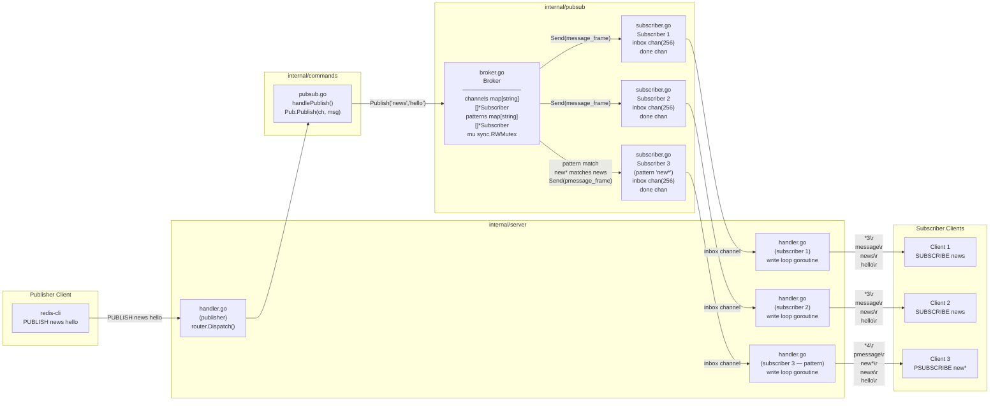
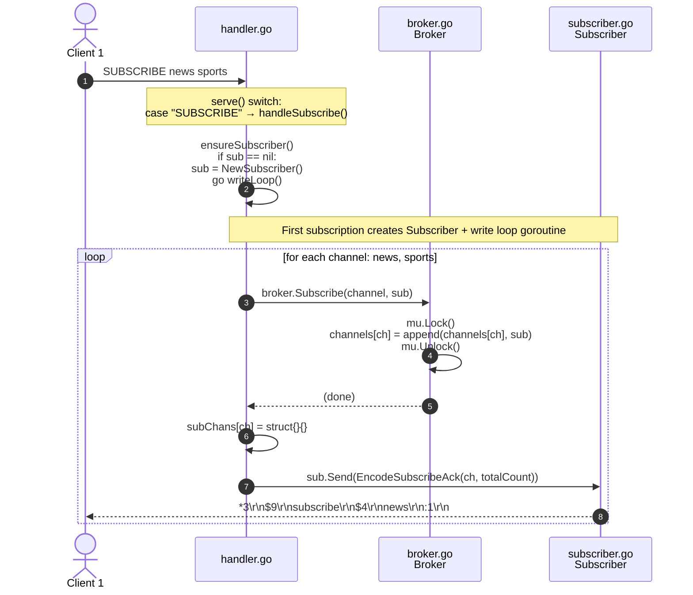
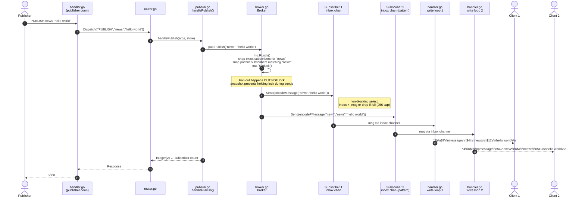
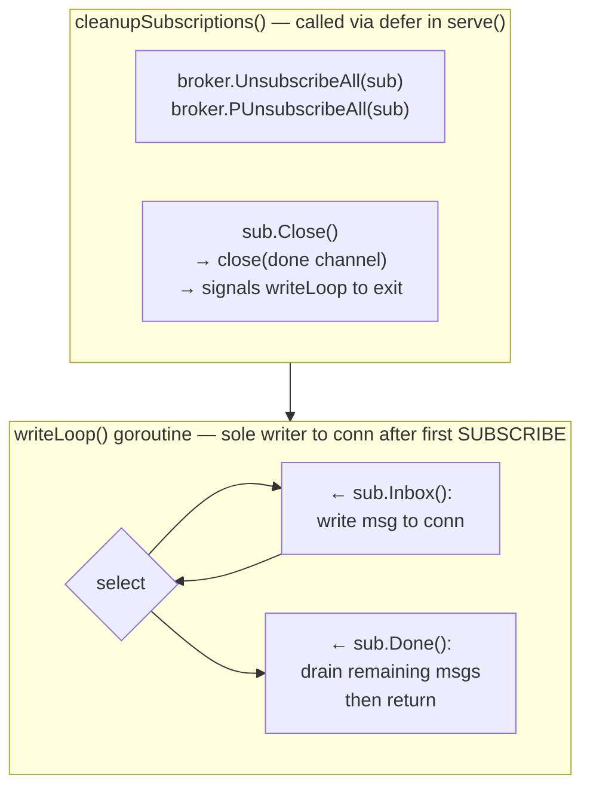

# Pub/Sub Flow

How messages travel from a `PUBLISH` call through the `Broker` to every subscribed client's TCP connection.

## Component Relationships

## SUBSCRIBE Sequence

## PUBLISH Sequence

## Write Loop & Cleanup

`sub.inbox` is **never closed** — only `sub.done` is closed. This prevents a panic if a concurrent `Publish` sends to the channel just as the subscriber is shutting down.

