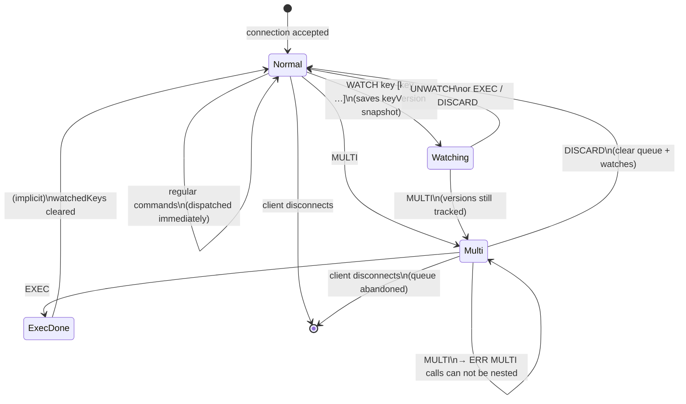
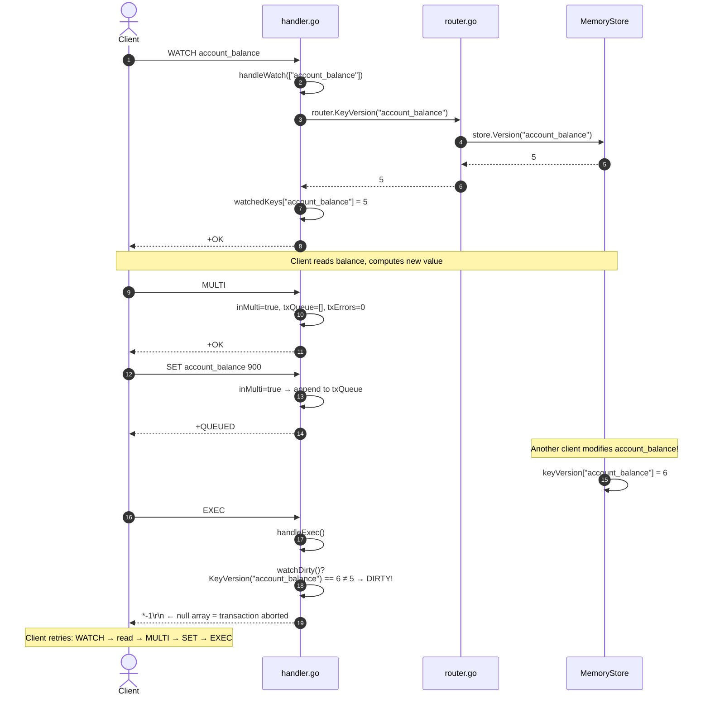
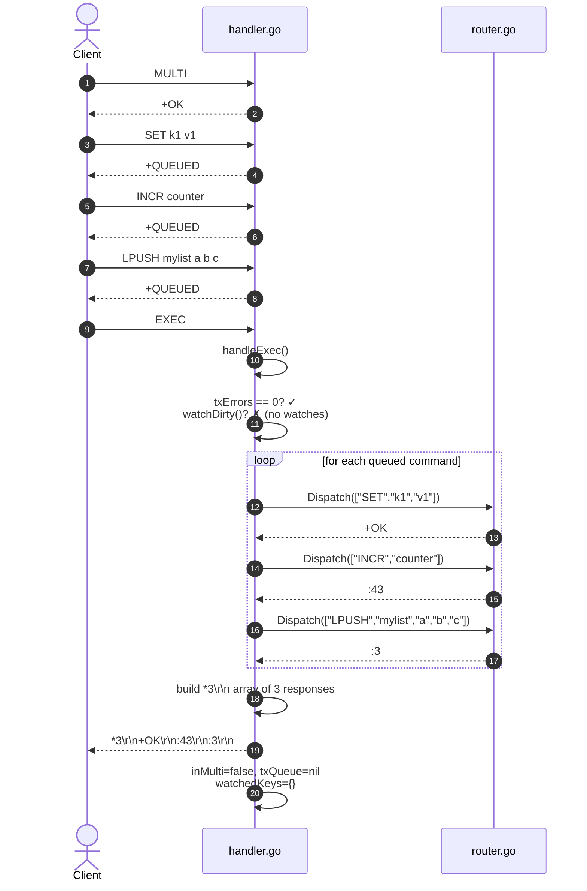
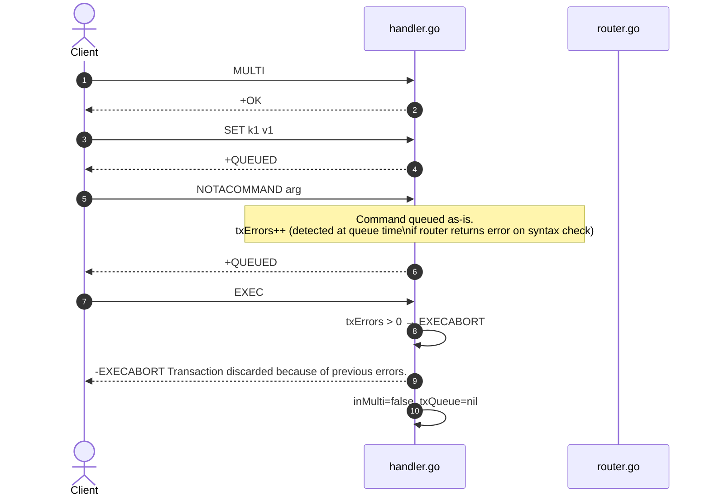
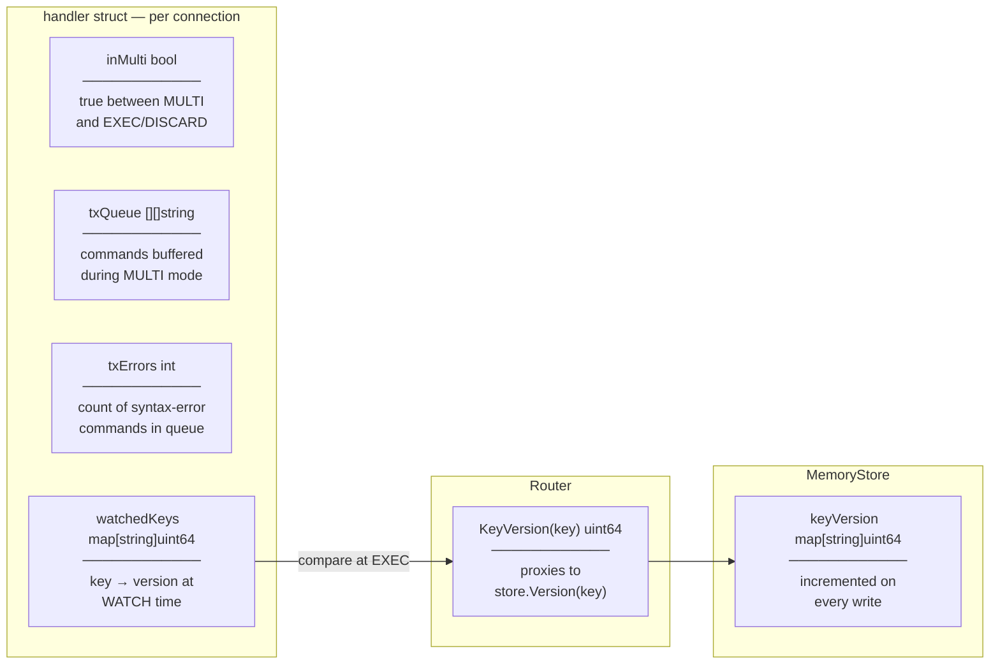

# Transaction Lifecycle

How `MULTI`, `EXEC`, `DISCARD`, and `WATCH` work inside `handler.go` — all transaction state is per-connection.

## Connection State Machine

## WATCH + EXEC — Optimistic Locking

## EXEC — Happy Path (no conflicts)

## EXEC with Command Error (EXECABORT)

## handler.go Transaction Fields

