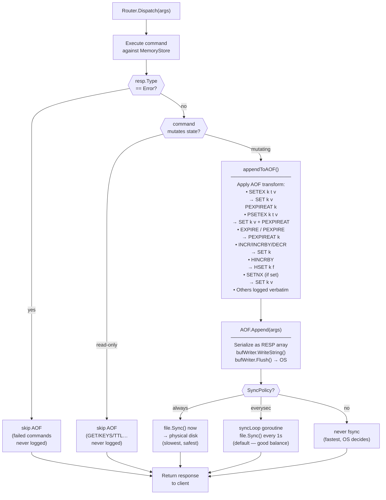
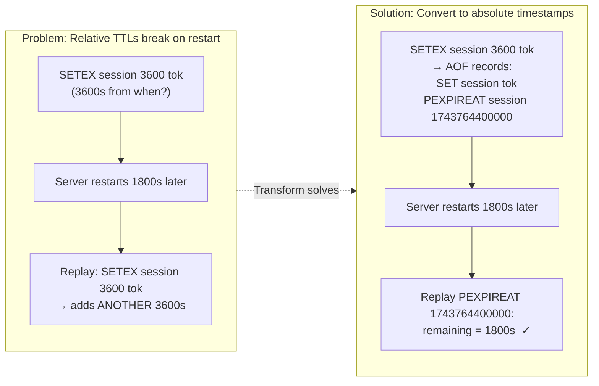
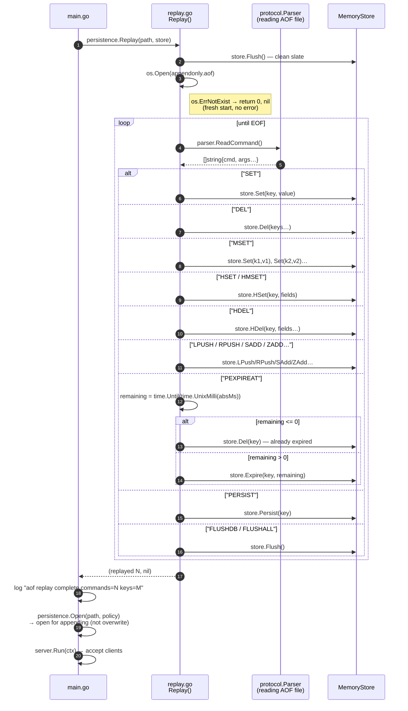
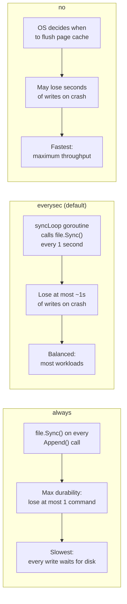

# AOF Persistence

Two complementary flows: the **write path** (how commands are durably logged) and the **startup replay** (how the store is reconstructed from the log).

## Write Path Overview



## Why Transform?



## Startup Replay Flow



## Fsync Policy Comparison



## AOF File Format (RESP arrays)

```
*3\r\n                   ← array of 3 elements
$3\r\n                   ← bulk string length 3
SET\r\n                  ← command name
$5\r\n
hello\r\n
$5\r\n
world\r\n

*3\r\n
$9\r\n
PEXPIREAT\r\n            ← always absolute ms timestamp
$5\r\n
hello\r\n
$13\r\n
1743768000000\r\n        ← Unix milliseconds

*4\r\n
$4\r\n
HSET\r\n
$6\r\n
user:1\r\n
$4\r\n
name\r\n
$3\r\n
bob\r\n
```
