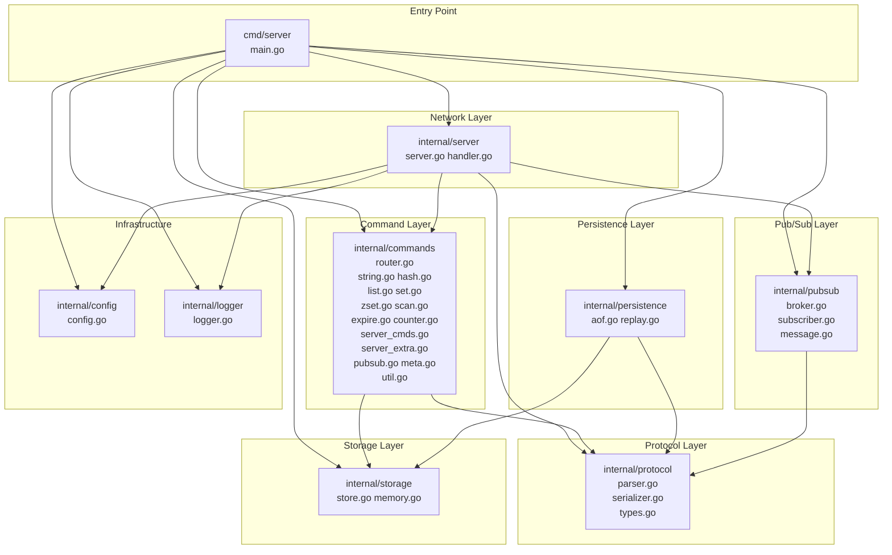
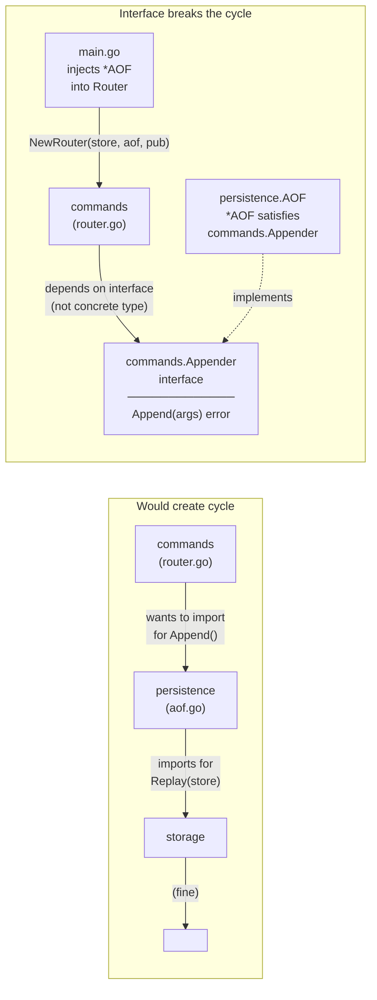
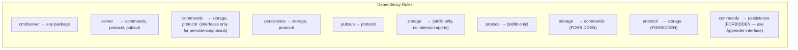

# Package Dependencies

The import graph shows which packages depend on which. **Lower layers never import upper layers** — this is enforced by `commands.Appender` and `commands.Publisher` interfaces that break potential cycles.

## Full Dependency Graph

## Why No Import Cycles?

## Layer Rules

