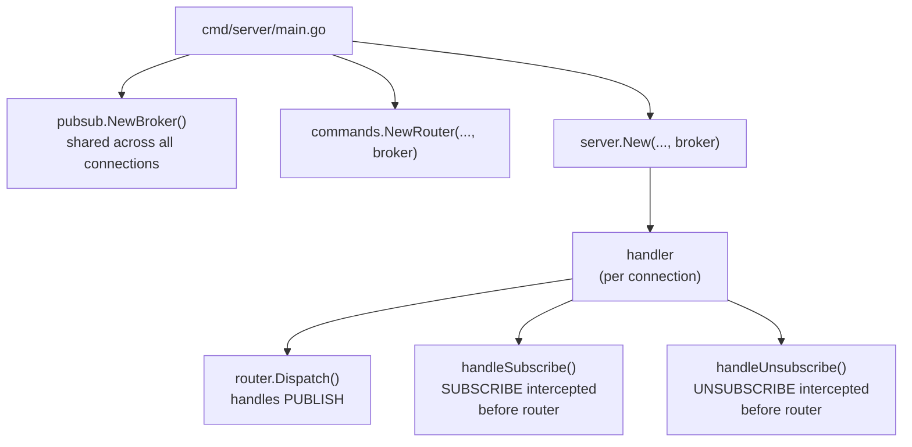
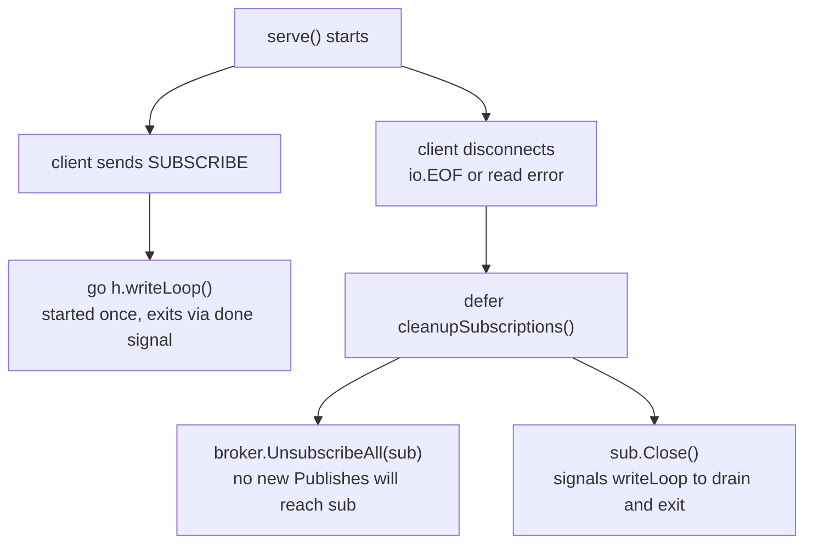
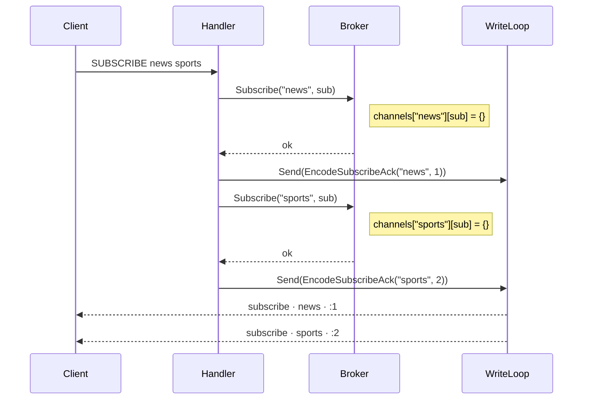
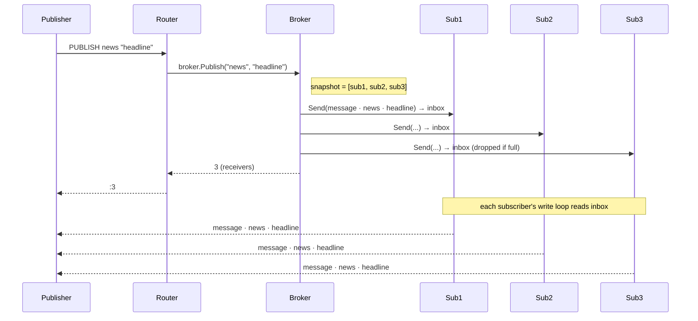
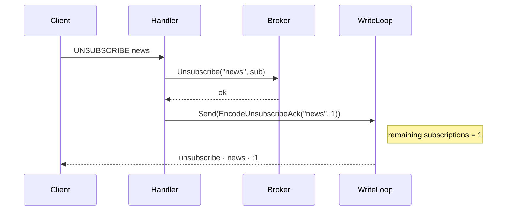

# Pub/Sub

This document covers the design, data structures, concurrency model, and integration details for the Redis-compatible Pub/Sub implementation in go-redis.

---

## Overview

Pub/Sub (publish/subscribe) is a messaging pattern where publishers send messages to named **channels** without knowing who is listening, and subscribers receive messages on channels they have registered interest in. Publishers and subscribers are fully decoupled.

go-redis implements the Redis pub/sub command set including pattern subscriptions:

| Command | Description |
|---------|-------------|
| `SUBSCRIBE <channel> [channel ...]` | Enter subscription mode and listen on one or more channels |
| `UNSUBSCRIBE [channel ...]` | Unsubscribe from specific channels, or all channels if none given |
| `PSUBSCRIBE <pattern> [pattern ...]` | Subscribe to channels matching a glob pattern |
| `PUNSUBSCRIBE [pattern ...]` | Unsubscribe from specific patterns, or all patterns if none given |
| `PUBLISH <channel> <message>` | Send a message to all subscribers; returns total receiver count |

Key properties:
- **Fire and forget** — messages are not persisted; if no subscriber is online, the message is dropped.
- **Fan-out** — one PUBLISH delivers to all current subscribers.
- **Non-blocking** — slow subscribers cannot stall publishers or other subscribers.
- **Goroutine-safe** — the broker handles concurrent publishers and subscribers safely.

---

## Architecture

### Where Pub/Sub Lives



The **Broker** is a singleton created at startup and injected into both the command router (for PUBLISH) and each per-connection handler (for SUBSCRIBE/UNSUBSCRIBE).

### Component Map

```
internal/pubsub/
  broker.go       — channel registry; Subscribe, Unsubscribe, Publish
  subscriber.go   — per-client inbox channel + shutdown signal
  message.go      — RESP encoding helpers for push frames and ACKs
internal/commands/
  pubsub.go       — Publisher interface + PUBLISH handler factory
internal/server/
  handler.go      — intercepts SUBSCRIBE/UNSUBSCRIBE; owns write loop goroutine
```

---

## Data Structures

### Broker

```go
type Broker struct {
    mu       sync.RWMutex
    channels map[string]map[*Subscriber]struct{} // exact-channel subscriptions
    patterns map[string]map[*Subscriber]struct{} // glob-pattern subscriptions
}
```

- `channels` maps a channel name to the **set** of subscribers currently listening (SUBSCRIBE).
- `patterns` maps a glob pattern to the **set** of subscribers (PSUBSCRIBE).
- A set (map to empty struct) is used instead of a slice so Subscribe/Unsubscribe are O(1).
- `sync.RWMutex` allows concurrent reads (multiple publishers) while serialising writes.
- Pattern matching uses `filepath.Match` — the same semantics as KEYS (`*`, `?`, `[ranges]`).

### Subscriber

```go
type Subscriber struct {
    inbox chan string   // buffered, size 256 — never closed
    done  chan struct{} // closed exactly once by Close()
    once  sync.Once
}
```

- `inbox` holds pre-serialised RESP strings queued by publishers.
- `done` is a shutdown signal read by the write loop goroutine.
- The inbox channel is **never closed**. This is intentional — see the Concurrency section.

---

## Concurrency Model

### Two write paths, never concurrent

Each client connection has exactly one goroutine writing to its TCP socket at any time:

| Phase | Writer |
|-------|--------|
| Before first SUBSCRIBE | Handler goroutine writes directly |
| After first SUBSCRIBE | Write loop goroutine is the sole writer |

Once the write loop starts, the handler goroutine only calls `sub.Send()` to queue messages in the inbox. This eliminates concurrent writes to the socket.

### Why the inbox channel is never closed

Closing a channel while another goroutine may be sending to it causes a panic in Go. The broker's `Publish` method:

1. Takes a **snapshot** of subscribers under a read lock.
2. Releases the lock.
3. Calls `sub.Send()` on each snapshot entry.

Between steps 2 and 3, a client may disconnect, causing `UnsubscribeAll` + `sub.Close()` to run. If `Close()` closed the inbox, the `Send()` in step 3 would panic.

**Solution:** `Close()` only closes the `done` channel. The inbox channel stays open and is drained by the write loop when it sees `done` is closed.

```
Publish:          Send checks done first → if open, sends to inbox (no panic)
Disconnect:       Close() closes done → write loop drains inbox and exits
```

### Publish flow (lock-minimising snapshot pattern)

```go
b.mu.RLock()
snapshot := copy of b.channels[channel]   // O(n subscribers)
b.mu.RUnlock()

// Send to each subscriber outside the lock — non-blocking.
for _, sub := range snapshot {
    sub.Send(encodedMessage)
}
```

The read lock is held only for snapshotting, never during channel sends. This means a slow subscriber's full inbox never delays other subscribers or the publisher.

### Write loop

```go
for {
    select {
    case msg := <-sub.Inbox():
        io.WriteString(conn, msg)
    case <-sub.Done():
        // drain remaining inbox then exit
    }
}
```

The write loop goroutine exits when `sub.Done()` fires (triggered by `sub.Close()` in `cleanupSubscriptions`) or when a write error occurs (broken TCP connection).

### Goroutine lifecycle guarantee



No goroutine leaks. The write loop always terminates because `sub.Close()` always runs via `defer`.

---

## Message Flow

### SUBSCRIBE



### PUBLISH



### UNSUBSCRIBE



---

## RESP Wire Format

All pub/sub messages use the existing RESP v2 serializer conventions (string-based, same as `protocol.Serialize`).

### Push message (sent to subscriber on PUBLISH)

```
*3\r\n
$7\r\nmessage\r\n
$<len>\r\n<channel>\r\n
$<len>\r\n<payload>\r\n
```

### Subscribe confirmation

```
*3\r\n
$9\r\nsubscribe\r\n
$<len>\r\n<channel>\r\n
:<activeSubscriptions>\r\n
```

### Unsubscribe confirmation

```
*3\r\n
$11\r\nunsubscribe\r\n
$<len>\r\n<channel>\r\n
:<remainingSubscriptions>\r\n
```

---

## Integration with the Command Router

**SUBSCRIBE** and **UNSUBSCRIBE** are intercepted in `handler.serve()` **before** `router.Dispatch` is called. They need direct access to the subscriber state and the write loop goroutine — both of which live in the handler, not the router.

**PUBLISH** is a normal `HandlerFunc` registered in the router. It accesses the broker through a `Publisher` interface (same pattern as the `Appender` interface for AOF), keeping the `commands` package free of a direct dependency on `pubsub`.

```go
// commands/pubsub.go
type Publisher interface {
    Publish(channel, message string) int
}
```

---

## PSUBSCRIBE — Pattern Subscriptions

A client can subscribe to a glob pattern instead of (or in addition to) an exact channel name:

```bash
PSUBSCRIBE "habits:*"      # receives messages on any habits:xxx channel
PSUBSCRIBE "user:?:events" # single-char wildcard
```

When a `PUBLISH habits:daily-reminder "check in"` arrives:
1. Broker delivers a **`message`** frame to all exact subscribers of `habits:daily-reminder`.
2. Broker delivers a **`pmessage`** frame to all pattern subscribers whose pattern matches.

### pmessage wire format

Pattern subscribers receive a 4-element array instead of the 3-element `message` array:

```
*4\r\n
$8\r\npmessage\r\n
$<len>\r\n<pattern>\r\n     ← the matched pattern (e.g. "habits:*")
$<len>\r\n<channel>\r\n     ← the actual channel (e.g. "habits:daily-reminder")
$<len>\r\n<payload>\r\n     ← the message payload
```

The extra `pattern` field lets the client know which `PSUBSCRIBE` triggered the delivery.

### Subscription count ACKs

ACKs for PSUBSCRIBE/PUNSUBSCRIBE include the **total** number of active subscriptions
(exact channels + patterns combined), matching Redis behaviour.

---

## Limitations vs Real Redis

| Feature | go-redis | Redis |
|---------|----------|-------|
| SUBSCRIBE / UNSUBSCRIBE | ✓ | ✓ |
| PSUBSCRIBE / PUNSUBSCRIBE | ✓ | ✓ |
| PUBLISH | ✓ | ✓ |
| Message persistence | ✗ | ✗ (same) |
| Cluster fan-out | ✗ | ✓ |
| Slow subscriber backpressure | Drop messages | Drop messages |
| Max inbox size | 256 messages | Configurable |
| Client tracking (CLIENT NO-EVICT) | ✗ | ✓ |

---

## Demo

**Terminal 1 — subscriber:**

```bash
redis-cli
> SUBSCRIBE habit.completed
Reading messages... (press Ctrl-C to quit)
1) "subscribe"
2) "habit.completed"
3) (integer) 1
```

**Terminal 2 — publisher:**

```bash
redis-cli
> PUBLISH habit.completed "walk 10000 steps"
(integer) 1
```

**Terminal 1 output after publish:**

```
1) "message"
2) "habit.completed"
3) "walk 10000 steps"
```

**Multiple subscribers:**

```bash
# Terminal 1
SUBSCRIBE habit.completed

# Terminal 2
SUBSCRIBE habit.completed

# Terminal 3
PUBLISH habit.completed "done"
# Returns: (integer) 2
```

Both subscribers in terminals 1 and 2 receive the message simultaneously.
